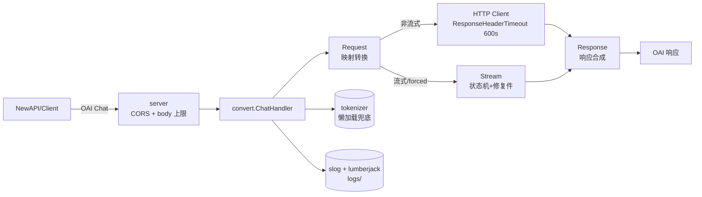

# mistral-bridge 设计档案

> 本文档只记载桥(mistral-bridge)自身的设计与决策。
> 渠道的协议客观事实见同目录 [Mistral-GLM5.2-API协议研究报告.md](Mistral-GLM5.2-API协议研究报告.md)——两文档权责分明:渠道事实不涉桥实现,本文档不复述协议细节。

**日期**:2026-08-18

---

## 1. 总览

**定位**:OAI Chat Completions ↔ Mistral `/v1/conversations` 纯协议转换转发器。单一进程、单一上游、单一监听端口;无鉴权、无 key、无多key调度、无重试、无计费、无会话状态。

**为什么需要桥**:GLM-5-2 在 Mistral 平台上的 OAI 兼容端点 `/v1/chat/completions` 上 TPM=0(直接 429),只能走 `/v1/conversations` 端点。该端点与 OAI 协议差异巨大:
- 响应无 `finish_reason` / `stop_reason`
- 流式为自定义双行 `event:` + `data:` SSE(10 种事件)
- 无 `system`/`tool` role(系统提示走 `instructions` 字段;tool 结果走 `function.result` entry)
- `content` 双态(字符串 / 块数组)
- 富媒体输入整条被拒(400 code 3051)
- usage 偶发归 0(flaky bug)
- guided-JSON + 流式 + reasoning=high 偶发正文开头重复
- `tool_choice: required` 是文法层约束(产生与 max_tokens 同量级的调用洪水)

## 2. 架构

- **并发模型**:`net/http` goroutine/conn;零 shared mutable state(每请求一个 streamSession)
- **背压**:下游 `io.Writer` 即 `http.ResponseWriter`,逐 chunk 立即 `Flush()`;无队列无批处理
- **级联取消**:上游 request 以 `r.Context()` 构造 → 下游断连自动断上游(省上游配额)
- **兜底懒加载**:tokenizer 只在 usage=0 路径触发,加载失败只降级不致错

## 3. 配置(zero-config)

**桥无 key**:纯转发器,`Authorization` 透传。配置面 11 项 env,全部有默认值,常见生产部署只需网络接入即可。

为何不把超时/body/连接池等做成配置:它们是桥自身的**资源护栏**(防上游异常大 body、SSE 挂死、log 爆盘),与协议无关、无场景需要调整——收为常量。

### BUILTIN_TOOLS 中文友好解析的底层原因

`.env` 手工编辑时用户大概率用中文输入法;全角逗号/顿号会被 docker compose 原样传进容器。若桥严格解析,用户会以为配上了 `web_search` 实际是个无法识别的未知项被静默丢掉。**宽容解析 + WARN 打印生效集合**是运维可见性设计,而非纵容错误输入。

## 4. 请求/响应映射速查

完整映射表见研究报告 §10/§11;这里只列最容易记错的几条:

| 现象 | 转换行为 |
|---|---|
| `content` 可为字符串/块数组 | 双态解析,合并 text/thinking 块 |
| 多阶段 outputs(tool.execution 分隔 M 段 message.output) | 按序串联 texts |
| 流式 `tool_calls.index` | **按新 tool_call_id 出现序**(0,1,2..),不是 output_index |
| 流式 usage | 恒定开启(不需 `stream_options.include_usage`) |
| 错误双 schema | `{detail:"..."}(鉴权)`、`{"object":"Error",...}(业务/422)` → 统一 OAI 模板 |

## 5. 修复件实现细节

### ① guided-JSON 流式首块折叠
**触发**:stream && response_format∈{json_object,json_schema}。
**算法**:text delta 起始微缓冲,直到见到第一个非空白非 `{` 的字符;头部若形如 `{`+空白+`{` → 折叠为 `{` 透传,其后恢复直通。
**零误伤**:任何合法 JSON 都不可能以 `{{`(允许空白间隔)开头。
**成本**:首 token 最多推迟 2 个 delta(<1ms)。

### ② usage=0 tokenizer 兜底
**触发**:done 事件或非流式响应 usage 三值全 0。
**实现**:embed 的 `glm52.json` + 自研字节级 BPE(scanner 手工等价 GLM Split regex,merges 按 HF BPE 贪心合并)。
**正确性**:黄金集 8 用例与 HF 官方 tokenizers(Rust)完全一致;研究阶段已坐实该库与上游计费 ±1。
**降级**:tokenizer 加载失败仅 WARN,usage 回 0 值(优先放弃修复而非编造)。

### ③ required 调用洪水熔断
**触发**:tool_choice=required(含对象形态单函数映射产物)。
**机制**:
1. 桥内部强制上游 stream=true(即使客户端要非流式)
2. 流内 FloodGuard 按函数名 `seen` 集合去重:首个放行,再见同名 → **立即 cancel 上游 ctx**
3. 客户端流式:已收到的增量照常发;断开后补 finish_reason=tool_calls + [DONE] + usage tokenizer 估算
4. 客户端非流式:聚合到 finalize 输出整包标准 JSON

**否决备选**:按 (name,args) 去重(多工具洪水参数各异)、内部钳 max_tokens(无法精确)、改 auto+prompt 注入(违反不改用户 prompt 原则)。

### ⑥ 富媒体占位清洗
**触发**:message.content 块数组中出现 `image_url` / `input_image` / `input_audio` / `input_file` / `file`。
**动作**:替换为 text 占位 `[image omitted]` / `[audio omitted]` / `[file omitted]`;清洗后无 text → 补一个占位防止空数组退化。
**位置全覆盖**:user/assistant(assistant 上游不校验仍清洗以保持一致)/system(拼 instructions 时文本形态)/tool(function.result 数组内插占位)。

## 6. Docker 安全面

| 项 | 值 | 理由 |
|---|---|---|
| 运行时镜像 | `gcr.io/distroless/static-debian12:nonroot` | 无 shell 无包管理器,攻击面最小 |
| 用户 | `65532:65532`(nonroot) | uid 已定死 |
| 根 FS | `read_only: true` | 状态只能写 /tmp(tmpfs)与 /app/logs(bind mount) |
| 提权 | `no-new-privileges: true` | 中立进程禁止 suid |
| capabilities | `cap_drop: ALL` | 纯网络中转无需任何 |
| 端口 | `EXPOSE 8080` 且 compose 无 `ports:` | 不接宿主,外网不可达;只能经 docker network 访问 |
| 网络 | 默认纯自足;生产取消注释块即以 external 引用 `new-api_default` | 规避 compose v2 label 硬校验;down 永不触碰外部网络 |
| 日志目录权限 | `bridge-init` 一次性容器 | 宿主侧零命令;幂等可重跑 |
| tokenizer 资产 | embed 进二进制 | 无运行时外部依赖;不涉镜像外文件 |

## 7. 日志

- **形态**:slog JSON 单行。lumberjack 轮转(64MB×7 份×14 天)+ console 双写。
- **红线**:永不记录 Authorization 值与请求体全文。
- **字段约定**(access):`req_id`、`x_upstream_req_id`(kong)、`model`、`stream`、`n_messages`、`n_tools`、`builtin_effective`、`upstream_status`、`status`、`outcome`(pass/nonstream/stream/error_normalized/missing_auth 等)、`latency_ms`、`ttft_ms`(流式首 chunk)、`usage_*`、`finish_reason`。
- **事件级**:`usage_repaired`(②触发)/`json_dup_folded`(①触发)/`flood_aborted`(③触发,另有 `kept_calls`)= info 级;`sse_idle_cut`、`downstream_abort`、`upstream_err` = info(常态降噪)。
- **decision** 修复静默过程 = debug 级(默认不可见)。

## 8. 测试矩阵

L0 `go vet` / `gofmt -l` / `go build`。
L1 `internal/...` 全包单测(参数 A/B/C/D 分档、messages 转换 zip、finish_reason、错误三 schema、富媒体6位置、required 熔断、JSON 折叠三形态、BUILTIN_TOOLS 19 用例、tokenizer 黄金集)。
L2 `httptest` 假上游(非流式/流式/missing-auth/422 归一)+ gap_stream.jsonl 真实抓包回放。
L3 `docker compose up -d --build` + curl 冒烟套件。

通过判据:L0/L1/L2 全绿;L3 冒烟四路结构合法且 log 无 WARN 级残留。

## 9. 现场实施决策(追加自 D-20 起,承接研究报告 19 条)

> 下列决策来自实施期间的现场观测与测试中发现,每条都点出**生效状态**与背景。

- **[D-20]** 桥零 key:Authorization 原样透传;推翻研究期桥持单 key 方案 —— **生效**
- **[D-21]** tokenizer 自研字节级 BPE:sugarme/tokenizer 难逃 GLM 负前瞻 regex panic;黄金集对齐官方库 —— **生效**
- **[D-22]** BUILTIN_TOOLS 中文宽容解析:全角符号识别归一 ASCII;未知项 WARN 过滤 —— **生效**
- **[D-23]** content 空值两态:纯 tool_calls→null;思考吃满只有 reasoning→ 空字符串 —— **生效**
- **[D-24]** tokenizer 失败时不编造 usage —— **生效**
- **[D-25]** JSON 折叠器形态 C:`{\"` + `{ "..."` 交错双份(buffer 恰两个 `{`)—— **生效**
- **[D-26]** `message.output` 不带 prefix(API 端点严格于 bora/Playground)—— **生效**
- **[D-27]** 空回观测标记 `empty_content: true`(access WARN),桥不做重试 —— **生效**
- **[D-28]** 内置搜索 premium 优于普搜(4 维实测,含日期敏感度/结构化条目/幻觉)—— **生效**
- **[D-29]** 网络自动创建语义(name: 而非 external:),down 不删外部创建 —— **部分勘误,见 D-31**
- **[D-30]** 测试 max_tokens 预算拉满 32000/64000,防推理截断假 bug —— **生效**
- **[D-31]** D-29 网络语义修正:compose v2 对同名已存网络做 label 硬校验直接拒启(v2.40.3 `resolveOrCreateNetwork` 源码实证,"自动复用"从未成立);compose ≥v5.4.0(2026-08)官方重构为按名复用仅 WARN。定案:compose.yaml 网络段整体注释(默认纯自足),生产接已建的 new-api_default 时成对取消注释、以 external 引用(桥上 name+auto-create 两种形态都放弃:v2 必炸、v5.4 才活,external 全版本安全);external 下 down 永不触碰该网络 —— **生效**
- **[D-32]** 模型名对外标准化 `glm-5.2`(Z.ai 产品名):modelAlias 三键全收(标准化名/上游真名 glm-5-2/平台别名 zai-glm-5-2),上游请求统一归一 glm-5-2,响应 model 回显客户端原值;/v1/models 只挂 glm-5.2 + aliases 列双旧名;E2E 全面改用 glm-5.2 实测闭环 —— **生效**
- **[D-33]** CC WebSearch 接管:CC 经 axonhub/new-api 把 WebSearch 下发为**普通 function**(axonhub Request 26174 实测),非官方网关下 CC 客户端无搜索执行能力 → 桥将归一命中 websearch(function.name 小写去 `_`/`-`)者收为搜索意图:config 已配搜索档(普/premium)则跟随,无配默认 `web_search_premium`(D-28);`MAP_CC_WEBSEARCH=false` 整个关闭直通 —— **生效**
- **[D-34]** cached_tokens 如实回 0:上游 done 事件 usage 仅三字段(原文实证),store 两态 A/B 实测无缓存任何信号(TTFT 噪声同分布、prompt 恒定全量计费)——渠道无 prompt caching;usage 恒带 `prompt_tokens_details:{cached_tokens:0}`(0 是事实,下游面板可见字段)—— **生效**
- **[D-35]** reasoning 默认开(无 env):缺省/auto/任意强度一律 high;仅客户端显式 `none` 直通关闭 —— **生效**
- **[D-36]** 日志时区:`import _ "time/tzdata"` embed + TZ env 生效;compose 默认 `TZ=Asia/Shanghai`;注:Windows 原生 Go 进程不读 TZ(走注册表时区,实测),此机制面向 Linux 容器 —— **生效**
- **[D-37]** bug 修复:stream 直发路径 usage 兜底修复值未回填 `s.usage`(非流式有回填、直发漏),access 日志 usage_* 恒 0 但 usage_repaired=true;客户端收到的 chunk 一直是对的,仅观测受损 —— **已修(F1)**
- **[D-38]** 修复件①覆盖面扩大:F5 默认 high 注入后实测**非流式** guided-JSON 同样触发首块重复(E2E A6/A7 复现);折叠器推广到 ConvertResponse(整串 Feed+Flush 同构语义),ConvertResponse 签名加 isJSON;access 日志非流式同打 `json_dup_folded` —— **生效**

## 10. 相关索引

- 渠道协议事实:[Mistral-GLM5.2-API协议研究报告.md](Mistral-GLM5.2-API协议研究报告.md)
- 快速上手与部署:[README.md](../README.md)
- AI 工作要点(命令/规则):[CLAUDE.md](../CLAUDE.md)
